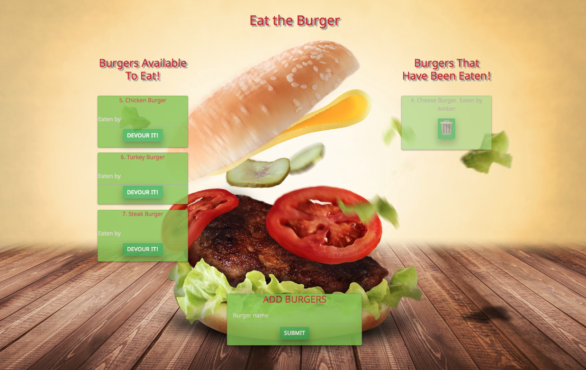

# Project Name

### sequelizedBurger1

Deployed app on Heroku [here](https:).

# Project Description:
Using the Sequelize ORM, the app has 3 basic CRUD functions. Sequelize is a promise-based Node.js ORM for MySQL.
A burger logger with MySQL, Node, Express, Handlebars and a homemade ORM (yum!). Be sure to follow the MVC design pattern; use Node and MySQL to query and route data in your app, and Handlebars to generate your HTML.

* Burger is a restaurant app that lets users input the names of burgers they'd like to eat.
* Whenever a user submits a burger's name, the app will display the burger on the left side of the page--waiting to be consumed.
* Each burger in the waiting area also has a button to eat it. When the user clicks it, the burger will move to the right side of the page.
* Burgers on the right side of the page have a delete button to remove it from view.
* The app stores every burger in a database, whether eaten or not.

# Technologies Used: 

Node.js, MySQL, Sequelize, Handlebars, Express, ORM, Materialize, Bootstrap, Affinity Photo. 

